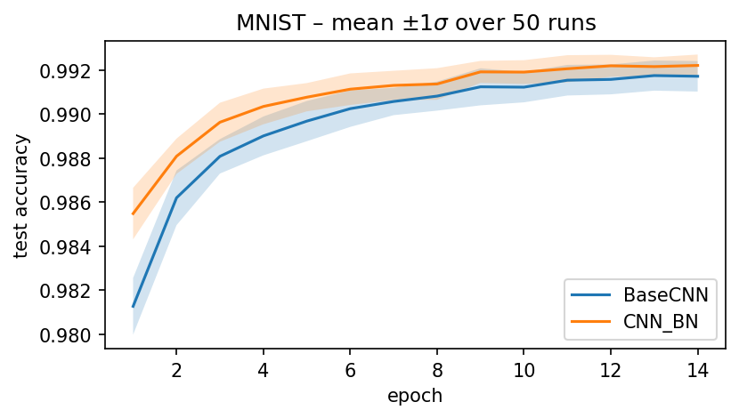
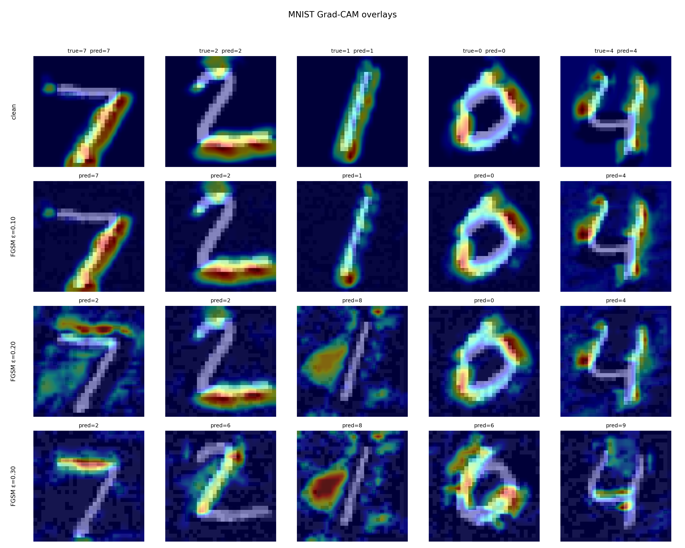

# CNN on MNIST with BatchNorm, Grad-CAM, and FGSM

**Analyzing performance improvements using Batch Normalization, and interpretability using Grad-CAM visualization, and FGSM adversarial attacks on MNIST.**

---

## Introduction

This repository demonstrates how Batch Normalization speeds up and enhances CNN training, visualizes CNN predictions using Grad-CAM for interpretability, and evaluates CNN robustness through adversarial examples generated by the Fast Gradient Sign Method (FGSM). Experiments combine these techniques to showcase the interactions between interpretability and robustness.

---

## Batch Normalization Analysis




Batch Normalization was assessed by training the CNN fifty times with and without the extra normalization layers. For this relatively simple architecture, BatchNorm chiefly speeds up convergence but does not significantly improve the asymptotic test accuracy; the accompanying plot reports the mean accuracy and the standard-deviation band across runs, highlighting the overlap in performance after the first few epochs.


    

---

## Grad-CAM and FGSM Analysis



### Grad-CAM

Grad-CAM (Selvaraju et al., 2017) is employed to make the CNN’s decision process visible. By back-propagating the gradients of a chosen class score into the last convolutional layer, the method weights each feature-map channel by its importance and then upsamples the weighted sum to the input resolution. The resulting heat-map shows which strokes of an MNIST digit drive the prediction—e.g., the loop of a “6” or the top bar of a “7”—letting us verify that the network attends to semantically sensible regions.

### FGSM Adversarial Attacks

To probe robustness, we generate adversarial examples with the Fast Gradient Sign Method (Goodfellow et al., 2015). For each clean image $x$ and true label $y$, we compute the gradient of the loss $L(\theta,x,y)$ with respect to the input pixels and add a scaled sign perturbation:

$$
x^{\text{adv}} = x + \epsilon \,\text{sign}\!\left(\nabla_x L\right),
$$

where $\epsilon$ ranges from 0.1 to 0.3 in our experiments. Even the smallest non-zero $\epsilon$ causes a noticeable drop in accuracy, demonstrating how a single gradient step can exploit model weaknesses.

### Grad-CAM on FGSM Images

Finally, we apply Grad-CAM to the adversarial images themselves. The juxtaposed heat-maps reveal how the model’s attention shifts under attack: salient regions often migrate to perturbed background pixels, different strokes of the numbers, or fade, illustrating that the CNN’s focus can be hijacked by the weak noise and underlining the link between interpretability and robustness.

    

---

## Usage Instructions

### Requirements

All dependencies are listed in **`requirements.txt`**.
Install them with:

```bash
pip install -r requirements.txt
```


### BatchNorm Experiment (`run_bn_statistic.py`)

To reproduce the above image, use (this, depending on your hardware, might be quite time consuming):

```bash
python3 -m experiments.batch_norm.run_bn_statistic --runs 50 --epochs 14
```

For a fast training variant, to produce trained models for the Grad-Cam and FGSM part of this project, you can instead use:

```bash
python3 -m experiments.batch_norm.run_bn_statistic --runs 1 --epochs 5
```

These are the implemented command line parameters:

* `--runs`: Number of repetitions   
* `--epochs`: Training epochs per run
* `--batch-size`: Size of training batches
* `--lr`: Learning Rate
    

### Grad-CAM & FGSM Visualization (`gradcam_and_fgsm.py`)

With the trained model files in the default location, run:

```bash
python3 -m experiments.gradcam_and_fgsm.gradcam_and_fgsm
```

These are the implemented command-line parameters for **`gradcam_and_fgsm.py`**:

* `--count`: Number of distinct base digits to visualise as columns in the output grid
* `--eps`: FGSM ε values (normalised 0-1 scale) that define the perturbation strength for each row after the clean images
* `--layer`: Network layer to hook for Grad-CAM (`bn2` or `conv2`)
* `--klass`: Target class to explain instead of the model’s own prediction
* `--cpu`: Force computation on CPU even if a GPU is available
* `--stepwise`: Apply FGSM iteratively in 100 small steps instead of one big step

    

---

## Folder Structure

```
.
├── src/
│   ├── dataloaders.py        # Data loading utilities
│   ├── models.py             # CNN models definitions
│   └── train_utils.py        # Training utilities and helper functions
│
└── experiments/
    ├── batch_norm/
    │   ├── run_bn_statistic.py       # Runs BatchNorm experiments
    │   ├── cnn_base.pt               # Trained CNN without BatchNorm
    │   ├── cnn_bn.pt                 # Trained CNN with BatchNorm
    │   └── accuracy_compare_50runs.png # BatchNorm accuracy comparison
    │
    └── gradcam_and_fgsm/
        ├── gradcam_and_fgsm.py       # Grad-CAM visualizations on FGSM examples
        └── gradcam_and_fgsm.png      # Visualization results
```

---

## References

- **Grad-CAM:** Selvaraju et al., "Grad-CAM: Visual Explanations from Deep Networks via Gradient-based Localization" ([paper](https://arxiv.org/abs/1610.02391))
    
- **FGSM:** Goodfellow et al., "Explaining and Harnessing Adversarial Examples" ([paper](https://arxiv.org/abs/1412.6572))
    
- **Batch Normalization:** Ioffe & Szegedy, "Batch Normalization: Accelerating Deep Network Training by Reducing Internal Covariate Shift" ([paper](https://arxiv.org/abs/1502.03167))
